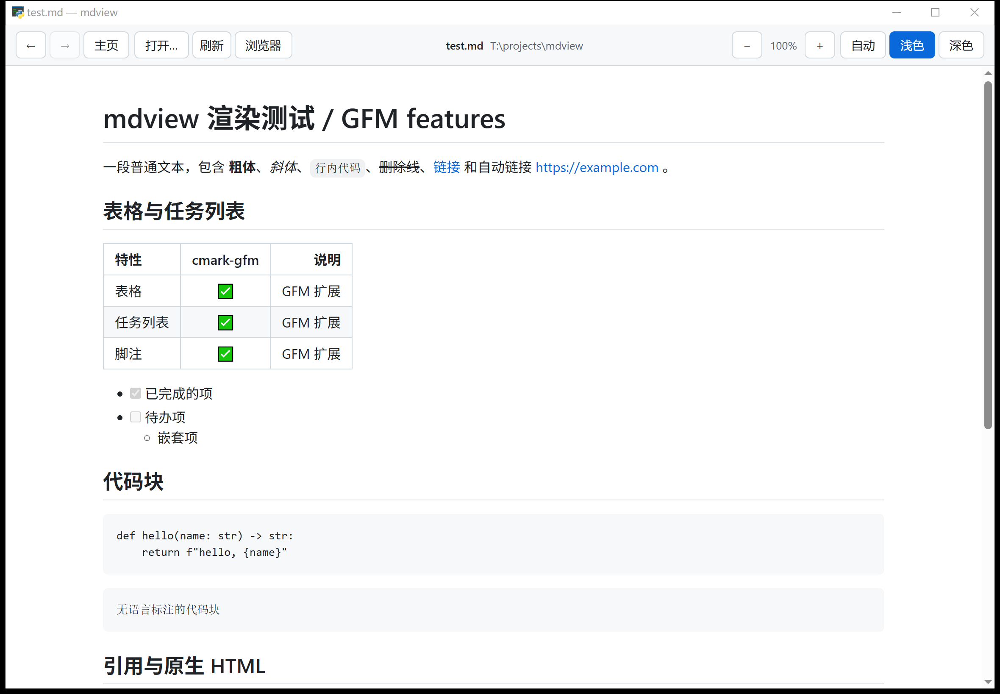
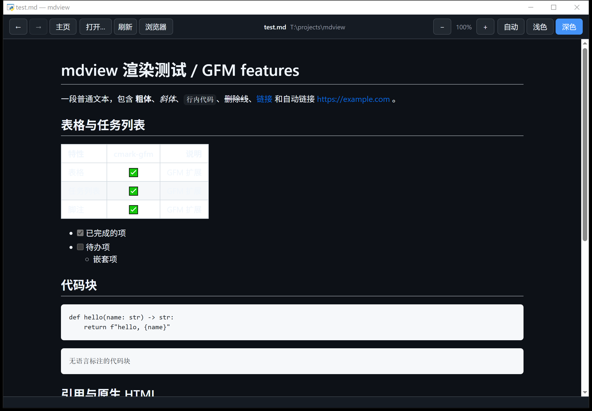

# mdview-gfm

[English](README.md) · **简体中文**

> [!NOTE]
> **本项目 100% 由 AI 生成。** 每一行代码、每一条提交信息和本文档都由 **DeepSeek Harness**
> 驱动 **DeepSeek V4.1 Flash** 模型产出；人类维护者负责定方向和审阅结果。提交都带有
> `Co-Authored-By: DeepSeek V4.1 Flash <noreply@deepseek.com>` 和
> `Generated-By: dsh 0.1.7-rc.2` 两个 trailer。

一个用 **GitHub 官方渲染器**的轻量 Markdown 查看器——原生窗口用来阅读，外加一个小巧的 CLI 把 Markdown 转成 HTML。





## 为什么要做它

市面上其他标榜「GitHub 风格」的 Markdown 查看器（MarkText、Obsidian、Typora、各种浏览器扩展……）实际都用 markdown-it、marked 或 goldmark 渲染，只是抄了样子。这个用的是 [github/cmark-gfm](https://github.com/github/cmark-gfm)——GFM 规范的行为定义就是它，配上 GitHub 官方的 [github-markdown-css](https://github.com/sindresorhus/github-markdown-css)。表格、任务列表、脚注、删除线、自动链接、原生 HTML 的表现和 GitHub 上完全一致，因为是同一个解析器加同一套样式表。

## 亮点

- **真的很小。** Python 源码四十多 KB，两个运行依赖，无需构建，没有框架。程序本身叫 `mdview`；仓库名叫 `mdview-gfm` 只是为了更容易被搜到。
- **日常使用很流畅。** 滚动长文档、切换文件、改主题、缩放都是瞬时的——在一台低功耗高分辨率平板级设备上实测如此。只有窗口出现那一下要等一会儿，见[启动耗时](#启动耗时)。
- **绿色软件。** 没有安装程序，不写注册表，不动 `PATH`。文件夹放哪都能跑，删掉文件夹就是卸载。见[运行数据放在哪](#运行数据放在哪)。
- **高分辨率屏专门处理过。** 200% 缩放下文字清晰，而不是被位图拉伸糊掉。
- **悬停显示链接地址。** 鼠标停在链接上时，底部状态栏显示目标地址；本地文件显示成 Windows 路径而不是 `file://` URL。
- **拖放打开。** 把 `.md` 文件拖到窗口上即可。

## 快速开始

### 1. 环境要求

| 项目 | 要求 |
|:-----|:-----|
| 系统 | Windows 10 / 11 —— GUI 通过 Edge WebView2 渲染 |
| Python | 3.8 或更高 |

### 2. 安装依赖

```powershell
python -m pip install pycmarkgfm pywebview
```

`pycmarkgfm`（142 KB 的 wheel）GUI 和 CLI 都要用；`pywebview` 只有 GUI 需要——只用 CLI 的话，装 `pycmarkgfm` 就够了。

无需构建：把那几个脚本和三个 `github-markdown-*.css` 放在一起就行。

### 3. 启动 GUI

双击 **`mdview-gui.pyw`**。`.pyw` 后缀意味着 Windows 用 `pythonw` 运行它，不会闪控制台黑框。

也可以从终端启动：

```powershell
.\mdview-gui.cmd                  # 空窗口，从工具栏选文件
.\mdview-gui.cmd README.md        # 直接打开某个文件
```

把 `.md` 文件拖到 `mdview-gui.pyw` 上，或者拖到已经打开的窗口里，都能打开。

### 4. 使用 CLI

CLI 本质上就是个 Markdown 转 HTML 的工具：它把一份独立的 HTML 写到 `%TEMP%\mdview\` 下的固定路径，然后请浏览器打开。

```powershell
.\mdview.cmd README.md                 # 渲染并用默认浏览器打开
python mdview.py README.md --no-open   # 只打印生成文件的路径
type notes.md | python mdview.py -     # 从标准输入读取
```

| 选项 | 作用 |
|:-----|:-----|
| `--out 路径` | 把 HTML 写到别处 |
| `--no-open` | 只生成，不打开浏览器 |
| `--safe` | 退回 cmark-gfm 的严格过滤模式（原生 HTML 全部转义） |
| `--css 路径` | 换一套样式表 |
| `--title 文本` | 指定页面标题 |

## 运行数据放在哪

没有安装步骤，也不会往项目文件夹里藏东西。写出的内容都在项目文件夹之外的三个位置：

| 路径 | 内容 |
|:-----|:-----|
| `%APPDATA%\mdview\config.json` | 主题、缩放、最近文件 |
| `%APPDATA%\mdview\webview\` | Edge WebView2 的配置缓存（仅 GUI） |
| `%TEMP%\mdview\` | CLI 和「用浏览器打开」生成的 HTML |

删掉这三处就回到全新状态；删掉项目文件夹就是卸载。

## 界面

| 控件 | 作用 | 快捷键 |
|:-----|:-----|:-------|
| ← / → | 在访问过的文档之间后退 / 前进 | `Alt+←` / `Alt+→` |
| 主页 | 回欢迎页；它算作新的一步，所以「后退」还能回到刚才在读的文档 | `Alt+Home` |
| 打开… | 弹出文件选择框 | `Ctrl+O` |
| 刷新 | 重新读取当前文件，并保持滚动位置 | `F5` |
| 浏览器 | 用系统默认浏览器打开同一份渲染结果 | `Ctrl+B` |
| − / + | 缩放 70%–200% | `Ctrl+-` / `Ctrl+=` |
| 自动 / 浅色 / 深色 | 主题，自动即跟随系统 | — |

几处值得了解的行为：

- 只有**鼠标左键**会触发链接。中键和右键都不打开任何东西（右键照常弹出上下文菜单）。
- 链接不会在窗口内打开——指向本地 Markdown 的就地切换文档，网页交给浏览器，其他文件交给系统默认程序。
- **最近文件**每次进主页都会刷新，文件已经不存在的条目会保留并标成「已失效」，这样挪走的文件还找得回来。同时开两个实例时，彼此打开过的文件都能看到。
- 文件读不出来时（被删、改名，或路径其实是个文件夹），工具栏上文件名那一格会说明原因，旁边的关闭按钮可以把提示收掉。正文原地留着不动；只有用前进/后退翻到的那一页会被换成说明——那些页每次都从硬盘重读，没有缓存。
- 主题、缩放和最近文件都会记住，下次启动自动恢复。

## 启动耗时

窗口先出现，内容随后跟上——这个间隔是 Edge WebView2 运行时初始化，与文档大小无关。在测试机上随系统负载在 6 到 20 秒之间波动，其中本项目自己的代码约占 1.3 秒。窗口出来之后，一切操作都是瞬时的。

## 关于 Edge WebView2

GUI 通过 **Microsoft Edge WebView2 Runtime** 渲染。它是系统组件，不是你必须使用的浏览器：

- Windows 11 自带，几乎所有保持更新的 Windows 10 机器上也有。
- 你**不必**使用 Edge 浏览器，也不必留着它。起作用的是 WebView2 **运行时**。
- 万一它缺失，从微软装 Evergreen Runtime 即可：<https://developer.microsoft.com/microsoft-edge/webview2/>

CLI 完全不需要 WebView2。

## 与 github.com 的差异

渲染器一致，但 GitHub 还会做一些后处理，这里没有做：

- **语法高亮** —— GitHub 在服务端给代码上色；这里只有 `<pre lang="...">` 结构，没有颜色。
- **Emoji 短代码** —— GitHub 会把 `:smile:` 变成 😄；这里原样显示。
- **标题锚点** —— GitHub 给每个标题加 `id` 以便锚点跳转；这里没有。

## 文件说明

| 文件 | 作用 |
|:-----|:-----|
| `mdview_gui.py` | GUI 主体：原生窗口、工具栏、拖放、导航 |
| `mdview-gui.pyw` | GUI 双击入口 |
| `mdview-gui.cmd` | 同一入口的命令行版本 |
| `mdview.py` | CLI 入口 |
| `mdview.cmd` | CLI 的 cmd 包装 |
| `mdview_core.py` | GUI 与 CLI 共用的渲染核心 |
| `github-markdown*.css` | GitHub 官方样式表 |
| `test.md` | 用于测试的 GFM 特性样例 |
| `docs/IMPLEMENTATION-NOTES.md` | 设计决策与平台坑位记录 |
| `THIRD-PARTY-NOTICES.md` | 再分发文件与依赖的许可证 |

## 许可证

MIT —— 见 [LICENSE](LICENSE)。

本仓库再分发了 [github-markdown-css](https://github.com/sindresorhus/github-markdown-css) 的三份样式表（MIT © Sindre Sorhus），其许可证原文收录在 [THIRD-PARTY-NOTICES.md](THIRD-PARTY-NOTICES.md) 中，同时列出了**不随仓库分发**的运行依赖的许可证。
